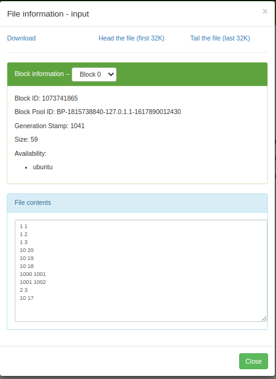

# K-Means Using MapReduce

## Overview:
K means is done in two steps 
 - Classify
 - Recenter

**Map :** Every data point , once given cluster centre, can be assigned to any cluster, so the mapper is going to emit the cluster label and data pair. Where the cluster label is going to serve as the key, and the data value is going to serve as the data point making this a key value pair.

**Reducer :** Recentering is an aggregation operation that is seperate for all cluster labels ie. different for all keys hence can be performed by Reducer. Reducer takes all the values for the same key (Cluster centre) and average it out. Reducer writes the final key (avg point of all value points). The updated centers are then updated in a sequence file for usage in further iterations.

- - - -
## Execution:

> Requirements:
- Hadoop 3.3.0
- input.txt (in data folder) uploaded to HDFS
```
$hdfs dfs -mkdir /data
``` 
```
$hdfs dfs -put 'data/input.txt' /data/input
``` 
- Open the project in Eclipse and Export as 'kmean.jar'

> Finally test the project:
```
$hadoop jar /home/soumi07/kmean.jar main.KMeans /kmeanOut
```
- - - -
## Output

### **Input Given into HDFS**


### **Output on HDFS**

